<p align="center">
  <a href="./README.md"></a>
  <a href="./README.ko.md"></a>
</p>
<p align="center"><sub>Switch language / 언어 전환</sub></p>

# T-WFC

Tensor Wave Function Collapse(`T-WFC`)는 Wave Function Collapse의 `중첩 -> 관측 -> 붕괴 -> 전파` 루프를 초소형 신경망 학습에 옮겨와, 경사하강법 없이도 학습이 가능한지 검증하는 연구용 프로토타입입니다.

<p align="center">
  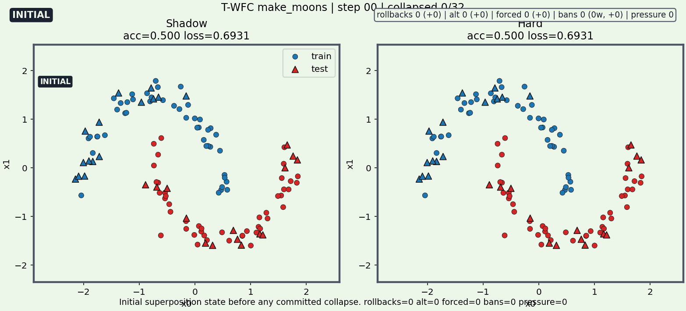
</p>
<p align="center"><sub><code>make_moons</code>에서의 안정적인 부분 붕괴 예시입니다. 32개 weight 중 8개가 commit되었고 rollback 압력 없이 decision boundary가 단계적으로 바뀝니다.</sub></p>

아래 시각화는 전부 실제 CLI 실행으로 생성하여 `docs/media/`에 커밋된 산출물이며, 설명용 목업이 아닙니다.

## 안정 경로 vs 압력 경로

<table>
  <tr>
    <td width="50%">
      
    </td>
    <td width="50%">
      
    </td>
  </tr>
  <tr>
    <td valign="top">
      <strong>안정 경로</strong><br>
      직접 commit이 대부분을 차지합니다. rollback burst 없이 boundary가 또렷해집니다.
    </td>
    <td valign="top">
      <strong>모순이 많은 복구 경로</strong><br>
      같은 toy setup에 tolerance를 거칠게 설정하면 rollback pressure, alt-choice retry, forced commit이 눈에 띄게 등장합니다.
    </td>
  </tr>
</table>

이 프로젝트의 핵심은 “최종 classifier가 나왔는가”만이 아닙니다. discrete weight state가 붕괴되는 동안 검색이 어떤 행동을 보였는지가 같이 중요합니다.

## 예전 정적 시각화 vs 현재 시각화

<table>
  <tr>
    <td width="50%">
      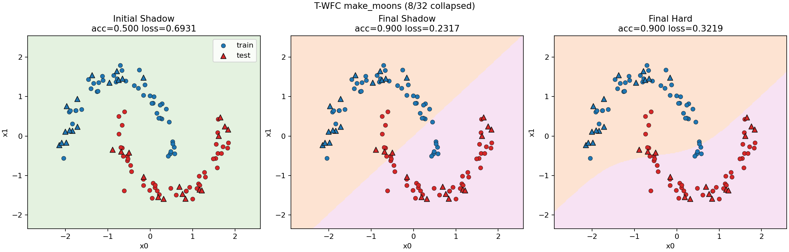
    </td>
    <td width="50%">
      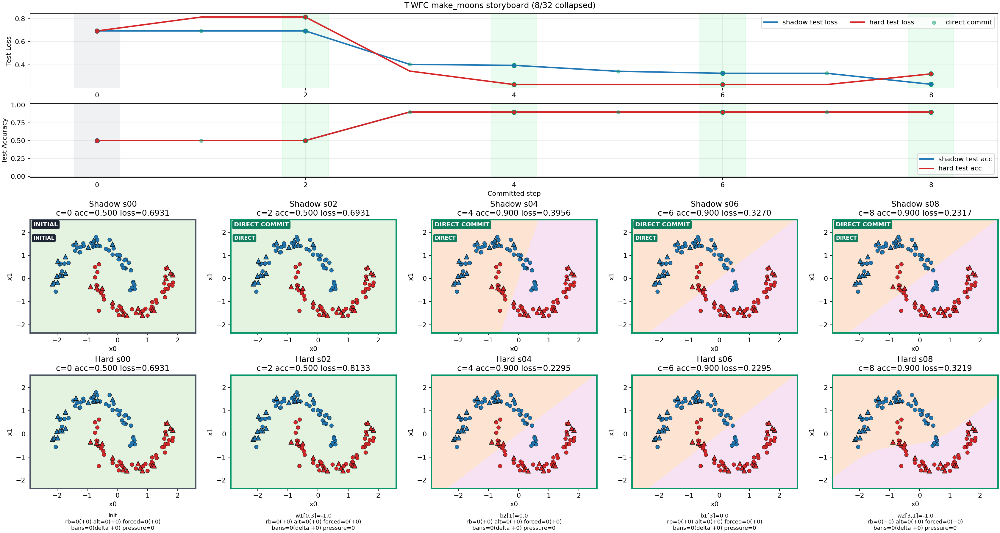
    </td>
  </tr>
  <tr>
    <td valign="top">
      <strong>예전 정적 view</strong><br>
      initial shadow, final shadow, final hard 상태를 비교합니다 — <em>run이 어디서 끝났는지</em>를 보여줍니다.
    </td>
    <td valign="top">
      <strong>현재 이벤트 인지형 view</strong><br>
      commit 기준 snapshot에 event badge, ban overlay, search-pressure 정보가 붙어 있어서 <em>어떻게 거기까지 갔는지</em>를 보여줍니다.
    </td>
  </tr>
</table>

## Stress Case: 왜 복구 로직이 중요한가

<table>
  <tr>
    <td width="50%">
      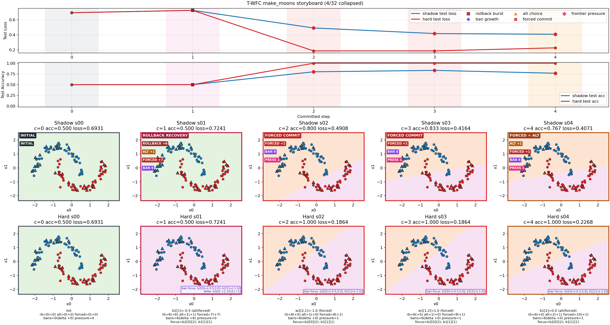
    </td>
    <td width="50%">
      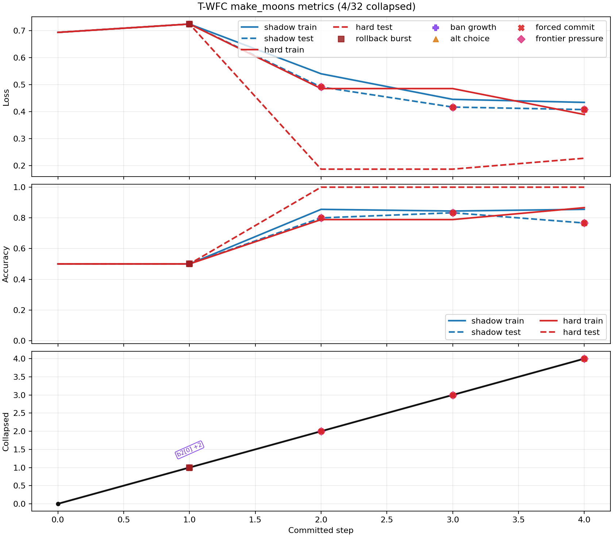
    </td>
  </tr>
  <tr>
    <td valign="top">
      <strong>Storyboard</strong><br>
      committed history 안에서 `ROLLBACK`, `ALT`, `FORCED`, ban focus, frontier pressure가 어디에서 나타났는지 보여줍니다.
    </td>
    <td valign="top">
      <strong>Metrics timeline</strong><br>
      모순이 많은 경로가 흔들리긴 해도 결국 유의미한 hard-state classifier로 회복되는 과정을 보여줍니다.
    </td>
  </tr>
</table>

Frontier 기반 forced-commit fallback이 들어가기 전에는 이 stress 설정이 `0/32` committed weights에서 끝날 수 있었습니다. 위 시각화를 보면 그 차이가 바로 드러납니다.

## Multi-Seed 동작

<p align="center">
  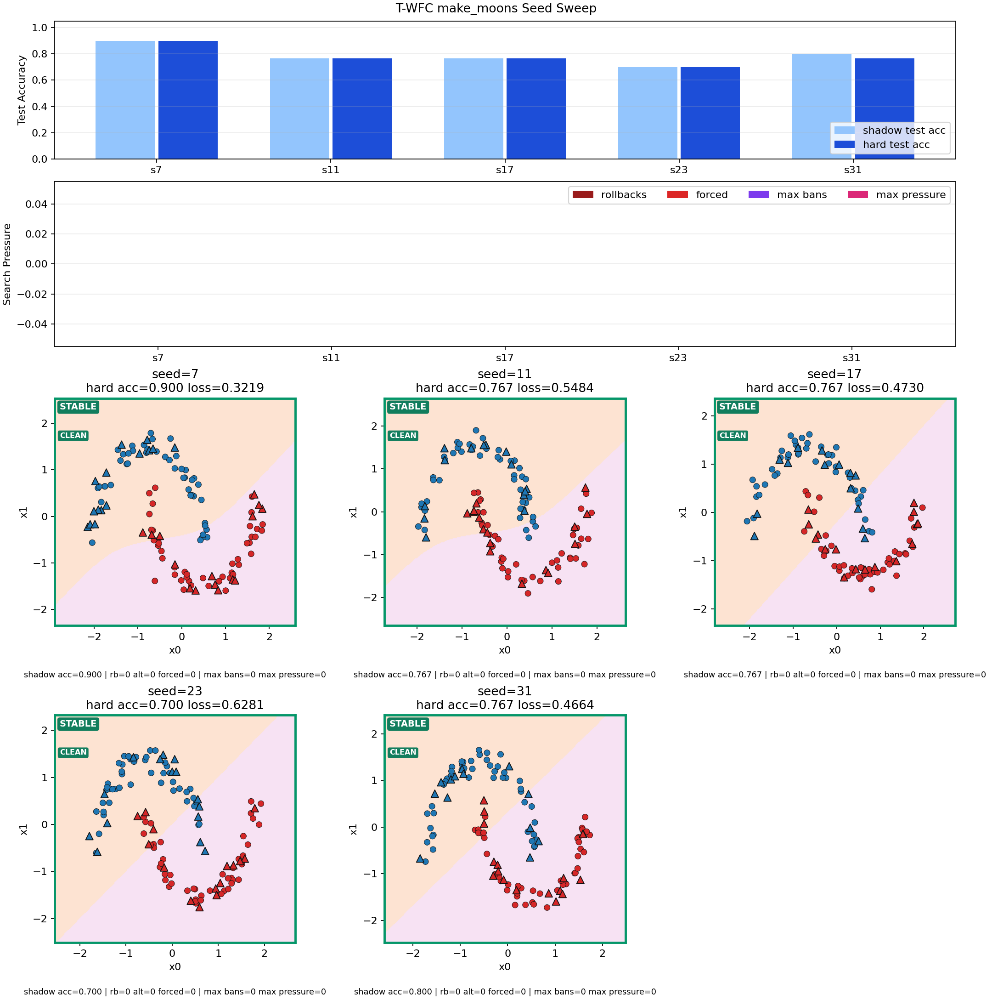
</p>
<p align="center"><sub><code>make_moons</code> seed sweep 예시입니다. 안정적인 seed, 상대적으로 약한 seed, search-pressure 요약을 한 화면에서 비교할 수 있습니다.</sub></p>

GIF가 단일 run을 보여준다면, gallery는 seed에 따른 편차를 보여줍니다. 생성되는 Markdown report에는 best/worst seed의 storyboard와 metrics 미리보기가 본문에 포함됩니다. 전체 예시: [docs/media/make_moons_seed_report.md](./docs/media/make_moons_seed_report.md).

## 최종 결과: T-WFC vs SGD+Momentum

T-WFC는 각 weight를 5개 이산값(`{-1, -0.5, 0, 0.5, 1}`) 중 하나로 붕괴시키고, SGD는 연속 실수 weight를 최적화합니다. Baseline은 momentum(0.9)과 learning-rate decay를 적용한 표준 SGD이며, 의도적으로 약화시킨 설정이 아닙니다. 모든 결과: `seed=7`, 결정론적 NumPy CPU 연산.

### 정확도 및 속도

| 데이터셋 | 비선형성 | T-WFC | SGD+Mom | T-WFC 시간 | SGD 시간 | 파라미터 |
|---------|---------|-------|---------|-----------|---------|---------|
| linear_binary | 없음 | **0.967** | **0.967** | 0.10s | 0.10s | 32 |
| blobs_binary | 없음 | **1.000** | **1.000** | 0.10s | 0.11s | 32 |
| make_blobs | 없음 | **1.000** | **1.000** | 0.20s | 0.10s | 51 |
| iris | 약함 | **0.972** | 0.944 | 0.27s | 0.13s | 67 |
| make_moons | 중간 | 0.933 | **1.000** | 0.11s | 0.11s | 32 |
| xor | 중간 | 0.660 | **1.000** | 0.12s | 0.15s | 32 |
| circles | 중간 | 0.620 | **1.000** | 0.12s | 0.15s | 32 |
| spiral | 강함 | 0.433 | **0.987** | 21.55s | 0.82s | 747 |

### T-WFC가 작동하는 곳: 선형 분리 가능 데이터

<table>
  <tr>
    <td width="33%">
      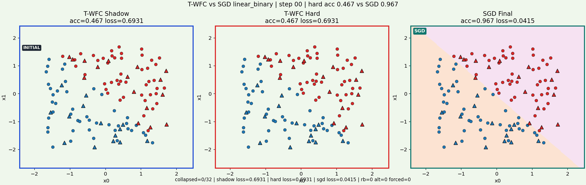
    </td>
    <td width="33%">
      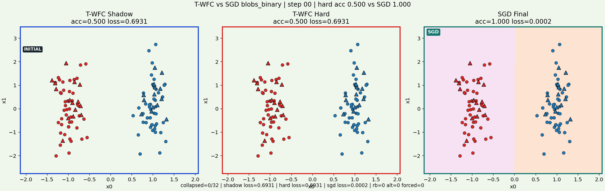
    </td>
    <td width="33%">
      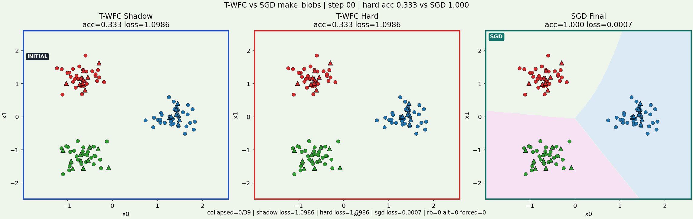
    </td>
  </tr>
  <tr>
    <td valign="top"><strong>linear_binary</strong>: 0.967 = 0.967</td>
    <td valign="top"><strong>blobs_binary</strong>: 1.000 = 1.000</td>
    <td valign="top"><strong>make_blobs</strong>: 1.000 = 1.000</td>
  </tr>
</table>

선형 분리 가능한 문제에서 T-WFC는 SGD와 완벽하게 동등합니다. 이산 5값 weight로도 단순한 초평면 경계를 표현할 수 있습니다. 백트래킹이나 롤백 없이 깔끔하게 수렴합니다.

### T-WFC가 실패하는 곳: 비선형 데이터

<table>
  <tr>
    <td width="50%">
      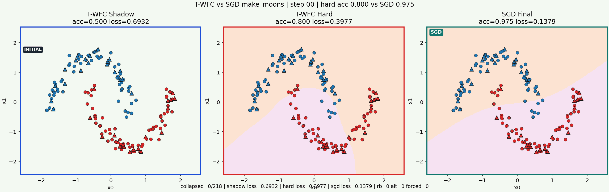
    </td>
    <td width="50%">
      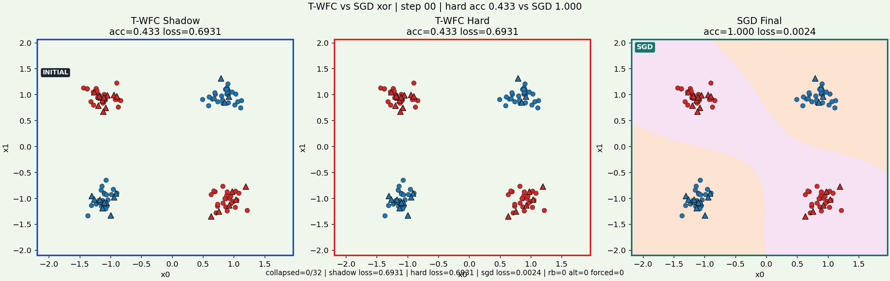
    </td>
  </tr>
  <tr>
    <td valign="top"><strong>make_moons</strong>: 0.933 vs 1.000 — 격차 발생 시작</td>
    <td valign="top"><strong>xor</strong>: 0.660 vs 1.000 — 사실상 실패</td>
  </tr>
  <tr>
    <td width="50%">
      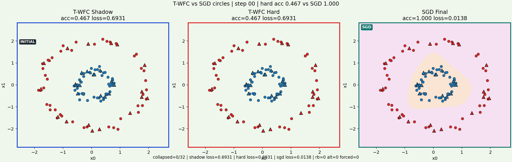
    </td>
    <td width="50%">
      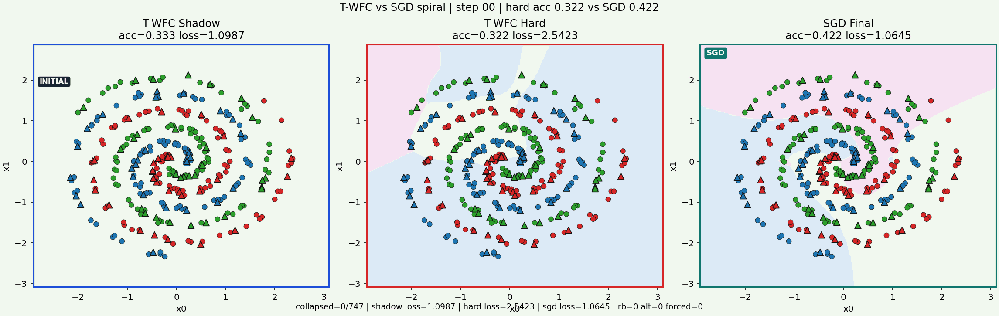
    </td>
  </tr>
  <tr>
    <td valign="top"><strong>circles</strong>: 0.620 vs 1.000 — 사실상 실패</td>
    <td valign="top"><strong>spiral</strong>: 0.433 vs 0.987 — 26배 느리고 근본적으로 불충분</td>
  </tr>
</table>

결정 경계에 비선형성이 필요해지면, 이산 5값의 조합으로는 표현이 불가능합니다. 문제 복잡도가 올라갈수록 격차가 커지고, spiral 규모(747 파라미터)에서는 26배 느리고 117배 더 많은 메모리를 사용합니다.

### 결론

PoC는 성공했습니다: WFC 스타일 붕괴가 역전파 없이 toy MLP를 실제로 학습시키며, 선형 분리 가능한 문제에서 SGD와 동등한 결과를 냅니다. 그러나 T-WFC는 비선형 문제로 일반화되지 않고, 효율적으로 확장되지 않으며, SGD 대비 속도나 메모리 이점이 없습니다. 상세 분석: [docs/RESULT.md](./docs/RESULT.md).

## 현재 상태

- 데이터셋: `linear_binary`, `blobs_binary`, `make_blobs`, `iris`, `make_moons`, `xor`, `circles`, `spiral`.
- 모델: 단일 hidden layer toy MLP 및 다층 구성 (예: `2-24-24-3`).
- 학습 루프: 관측, 단일 weight 붕괴, 전파, rollback-aware backtracking, forced-commit fallback.
- 시각화: storyboard, GIF, metrics timeline, multi-seed gallery/report, `T-WFC vs SGD` 비교 board.
- `pyproject.toml`을 통해 설치형 `t-wfc` CLI를 제공합니다.
- 전체 기능 이력은 [CHANGELOG.md](./CHANGELOG.md)를 참고하세요.

## 빠른 시작

```bash
python3 -m pip install -e .
t-wfc --dataset make_moons --max-steps 8 --show-steps 6
t-wfc --dataset iris --hidden-layers 16,16 --max-steps 18 --compare-sgd --show-steps 6
```

시각화, seed sweep, stress test 옵션은 `t-wfc --help`를 참고하세요. 전체 실행 레시피 예시는 [docs/VERIFICATION.md](./docs/VERIFICATION.md)에 있습니다.

## 문서

- 컨셉 문서, 영어: [docs/CONCEPT.en.md](./docs/CONCEPT.en.md)
- 컨셉 문서, 한국어: [docs/CONCEPT.md](./docs/CONCEPT.md)
- 검증 가이드, 영어: [docs/VERIFICATION.en.md](./docs/VERIFICATION.en.md)
- 검증 가이드, 한국어: [docs/VERIFICATION.md](./docs/VERIFICATION.md)
- 변경 이력: [CHANGELOG.md](./CHANGELOG.md)

## 저장소 구조

- `src/t_wfc/data.py`: 데이터셋 로딩과 split
- `src/t_wfc/model.py`: 단일/다층 MLP 정의와 SGD baseline용 backprop 지원
- `src/t_wfc/baseline.py`: 비교용 `numpy` SGD baseline 학습
- `src/t_wfc/state.py`: 이산 확률 상태
- `src/t_wfc/trainer.py`: 붕괴 루프, rollback 로직, 메트릭, snapshot
- `src/t_wfc/batch.py`: seed list 기반 반복 실험 실행과 seed별 artifact export
- `src/t_wfc/reporting.py`: inline highlight preview와 drill-down 링크가 포함된 Markdown seed-sweep report 생성
- `src/t_wfc/visualization.py`: overview, progress, metrics, storyboard, GIF, seed gallery, `T-WFC vs SGD` 비교 plot 생성
- `src/t_wfc/cli.py`: 커맨드라인 진입점
- `docs/media/`: 이 README에서 직접 사용하는 공개용 시각화 샘플 모음
- `pyproject.toml`: 패키지 메타데이터, 의존성, `t-wfc` console script

## 참고

- 아직 완성된 프레임워크가 아니라 연구용 프로토타입입니다.
- 런타임 핵심 의존성은 `numpy`입니다.
- 시각화 출력에는 `matplotlib`를 사용합니다.
- GIF export에는 `Pillow`를 사용합니다.
