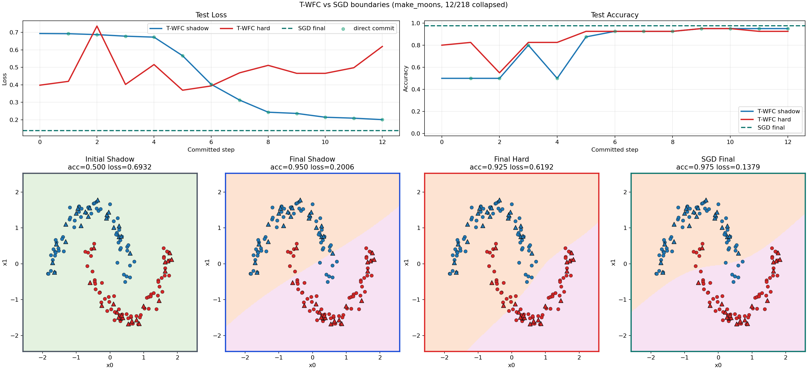
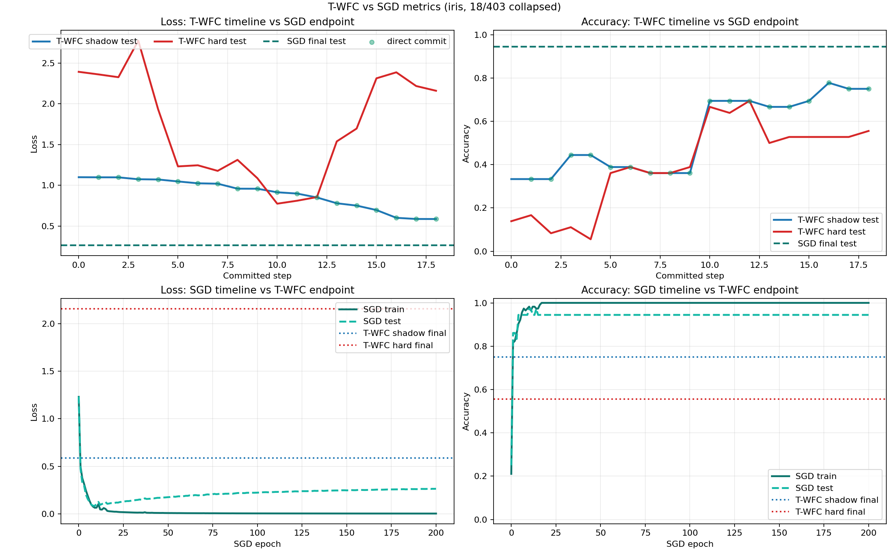

<p align="center">
  <a href="./README.md"></a>
  <a href="./README.ko.md"></a>
</p>
<p align="center"><sub>Switch language / 언어 전환</sub></p>

# T-WFC

Tensor Wave Function Collapse (`T-WFC`) is a research prototype that tests whether a tiny neural network can be trained without gradient descent by borrowing the `superposition -> observation -> collapse -> propagation` loop from Wave Function Collapse.

<p align="center">
  
</p>
<p align="center"><sub>Clean partial collapse on <code>make_moons</code>: 8/32 weights committed, no rollback pressure, decision boundary changes visible step by step.</sub></p>

All visuals below are real artifacts generated by the CLI and committed under `docs/media/` — not mock illustrations.

## What This README Is Trying To Show

- What a normal collapse path looks like when the search is stable.
- What a contradiction-heavy path looks like when rollback and forced commits kick in.
- Why the current visual stack is more informative than a single final-state plot.

## Clean Path vs Pressure Path

<table>
  <tr>
    <td width="50%">
      
    </td>
    <td width="50%">
      
    </td>
  </tr>
  <tr>
    <td valign="top">
      <strong>Stable path</strong><br>
      Direct commits dominate. The boundary sharpens without rollback bursts.
    </td>
    <td valign="top">
      <strong>Contradiction-heavy recovery path</strong><br>
      The same toy setup with a harsh tolerance setting triggers rollback pressure, alt-choice retries, and forced commits.
    </td>
  </tr>
</table>

This is the main story of the project: not just whether a final classifier appears, but how the search behaves while the discrete weight state collapses.

## Static View vs Current View

<table>
  <tr>
    <td width="50%">
      
    </td>
    <td width="50%">
      
    </td>
  </tr>
  <tr>
    <td valign="top">
      <strong>Earlier static view</strong><br>
      Compares initial shadow, final shadow, and final hard states — shows <em>where the run ended</em>.
    </td>
    <td valign="top">
      <strong>Current event-aware view</strong><br>
      Commit-aligned snapshots with event badges, ban overlays, and search-pressure context — shows <em>how it got there</em>.
    </td>
  </tr>
</table>

## Stress Case: Why Recovery Logic Matters

<table>
  <tr>
    <td width="50%">
      
    </td>
    <td width="50%">
      
    </td>
  </tr>
  <tr>
    <td valign="top">
      <strong>Storyboard</strong><br>
      Shows where `ROLLBACK`, `ALT`, `FORCED`, ban focus, and frontier pressure appear in the committed history.
    </td>
    <td valign="top">
      <strong>Metrics timeline</strong><br>
      Shows that the contradiction-heavy path is noisy, but still recovers into a useful hard-state classifier.
    </td>
  </tr>
</table>

Before the frontier-based forced-commit fallback existed, this stress setting could terminate at `0/32` committed weights. The visuals above make that difference easy to spot.

## Multi-Seed Behavior

<p align="center">
  
</p>
<p align="center"><sub>Seed sweep on <code>make_moons</code>: stable seeds, weaker seeds, and search-pressure summaries can be compared side by side.</sub></p>

Where the GIFs show a single run, the gallery shows how much behavior varies across seeds. The generated Markdown report includes inline storyboard and metrics previews for the best and worst seeds. Full example: [docs/media/make_moons_seed_report.md](./docs/media/make_moons_seed_report.md).

## T-WFC vs SGD

<p align="center">
  
</p>
<p align="center"><sub>T-WFC collapse progression alongside the SGD baseline on <code>make_moons</code>.</sub></p>

<table>
  <tr>
    <td width="50%">
      
    </td>
    <td width="50%">
      
    </td>
  </tr>
  <tr>
    <td valign="top">
      <strong>Presentation-friendly case: make_moons</strong><br>
      T-WFC hard weights reach <code>0.925</code> test accuracy while SGD reaches <code>0.975</code>. This is still the most eye-catching comparison because the gap stays relatively small and the collapse process is easy to read.
    </td>
    <td valign="top">
      <strong>Honest scaling case: spiral</strong><br>
      The deeper model now moves thanks to symmetry-breaking jitter, but the GIF also makes the remaining quality gap obvious. T-WFC hard test accuracy reaches <code>0.367</code> while SGD reaches <code>0.422</code>.
    </td>
  </tr>
</table>

<p align="center">
  
</p>
<p align="center"><sub><code>iris</code> is the clean metric-gap example: T-WFC shadow test accuracy reaches <code>0.750</code>, hard test accuracy reaches <code>0.556</code>, and SGD reaches <code>0.944</code>.</sub></p>

The `make_moons` GIF is the quickest demo of T-WFC doing something interesting. `spiral` and `iris` show the current scaling limits against SGD.

## Current Status

- `make_moons`, `spiral`, and vendored `iris.csv` are supported.
- The model path now supports both the original single-hidden-layer toy MLP and deeper configurations such as `2-24-24-3` or `4-16-16-3`.
- Multi-layer runs now apply a small symmetry-breaking initial jitter by default so that single-weight observation does not get stuck in a flat, zero-signal state.
- Multi-layer runs now also resolve to a sharper default observation temperature unless the user sets one explicitly, which keeps deeper-model posteriors from staying as flat as the original single-layer default.
- The trainer already supports observation, single-weight collapse, propagation, rollback-aware backtracking, and hybrid-scored forced commits.
- `make_moons` runs can save:
  - an overview plot with `initial shadow / final shadow / final hard`
  - a progress timeline plot across committed collapse steps
  - a per-snapshot frame sequence for step-by-step inspection
  - a combined storyboard with metrics, selected snapshots, and event highlights
  - an animated GIF built from committed snapshots with event badges and cumulative counters
  - rollback bursts, alt-choice retries, and forced commits are rendered as separate signals instead of one blended event tag
  - forbidden-value bans and frontier pressure are also rendered as separate overlay signals
  - ban overlays now identify which weights accumulated bans, not only how many bans existed
- Any dataset run can save a metrics timeline plot for shadow/hard loss and accuracy.
- Multi-seed runs can save a comparison gallery, per-seed drill-down artifacts, and a Markdown report with best/worst seed highlights, inline preview images, peak-ban summaries, and direct links to each seed's metrics/storyboard/GIF outputs.
- The CLI can now run a `numpy` SGD baseline on the same MLP so T-WFC runs can be compared against a conventional optimizer path.
- 2D runs can now save a `T-WFC vs SGD` boundary board and comparison GIF, while any dataset can save a `T-WFC vs SGD` metrics board.
- The package now exposes an installable `t-wfc` CLI via `pyproject.toml`.

## Quickstart

```bash
python3 -m pip install -e .
t-wfc --help
PYTHONPATH=src python3 -m unittest discover -s tests
t-wfc --dataset make_moons --max-steps 8 --show-steps 6
t-wfc --dataset spiral --samples 240 --hidden-layers 24,24 --max-steps 18 --show-steps 6
t-wfc --dataset iris --hidden-layers 16,16 --max-steps 18 --compare-sgd --sgd-epochs 160 --sgd-batch-size 24 --show-steps 6
t-wfc --dataset make_moons --samples 160 --hidden-layers 12,12 --max-steps 12 --compare-sgd --sgd-epochs 140 --sgd-batch-size 24 --save-baseline-metrics-plot artifacts/make_moons/plots/twfc_vs_sgd_metrics.png --save-baseline-comparison-plot artifacts/make_moons/plots/twfc_vs_sgd_boundaries.png --save-baseline-comparison-gif artifacts/make_moons/animations/twfc_vs_sgd.gif --max-frame-count 6 --gif-frame-duration-ms 320
t-wfc --dataset make_moons --max-steps 8 --show-steps 2 --save-plot artifacts/make_moons/plots/overview.png --save-progress-plot artifacts/make_moons/plots/progress.png --progress-panels 5 --save-metrics-plot artifacts/make_moons/plots/metrics.png --save-frames-dir artifacts/make_moons/frames/steps --max-frame-count 6
t-wfc --dataset make_moons --max-steps 8 --show-steps 2 --save-storyboard artifacts/make_moons/plots/storyboard.png --storyboard-panels 5 --save-gif artifacts/make_moons/animations/steps.gif --max-frame-count 6 --gif-frame-duration-ms 350
t-wfc --dataset make_moons --max-steps 4 --backtrack-tolerance -10 --rollback-depth 1 --max-frontier-rollbacks 1 --max-attempt-multiplier 12 --show-steps 4 --save-metrics-plot artifacts/make_moons/plots/stress_metrics.png --save-storyboard artifacts/make_moons/plots/stress_storyboard.png --storyboard-panels 5 --save-gif artifacts/make_moons/animations/stress.gif --max-frame-count 5 --gif-frame-duration-ms 420
t-wfc --dataset make_moons --max-steps 8 --seed-list 7,11,17,23,31 --save-seed-gallery artifacts/make_moons/plots/seed_gallery.png --gallery-columns 3 --save-seed-artifacts-dir artifacts/make_moons/reports/seed_runs --save-md-report artifacts/make_moons/reports/seed_report.md --report-title "T-WFC make_moons Seed Sweep"
```

## Documentation

- Concept, English: [docs/CONCEPT.en.md](./docs/CONCEPT.en.md)
- Concept, Korean: [docs/CONCEPT.md](./docs/CONCEPT.md)
- Verification, English: [docs/VERIFICATION.en.md](./docs/VERIFICATION.en.md)
- Verification, Korean: [docs/VERIFICATION.md](./docs/VERIFICATION.md)
- Change history: [CHANGELOG.md](./CHANGELOG.md)

## Repository Map

- `src/t_wfc/data.py`: dataset loading and splits
- `src/t_wfc/model.py`: single-layer and multi-layer MLP definition plus backprop support for the SGD baseline
- `src/t_wfc/baseline.py`: `numpy` SGD baseline training for side-by-side comparison
- `src/t_wfc/state.py`: discrete probability state
- `src/t_wfc/trainer.py`: collapse loop, rollback logic, metrics, snapshots
- `src/t_wfc/batch.py`: repeated experiment runs across seed lists and per-seed artifact export
- `src/t_wfc/reporting.py`: Markdown seed-sweep report generation with inline highlight previews and drill-down links
- `src/t_wfc/visualization.py`: overview, progress, metrics, storyboard, GIF, seed-gallery, and `T-WFC vs SGD` comparison plots
- `src/t_wfc/cli.py`: command-line entry point
- `docs/media/`: curated public showcase media used directly in this README
- `pyproject.toml`: package metadata, dependencies, and the `t-wfc` console script

## Notes

- This is still a research prototype, not a polished training framework.
- `numpy` is the main runtime dependency.
- `matplotlib` is used for visualization output.
- `Pillow` is used for GIF export.
