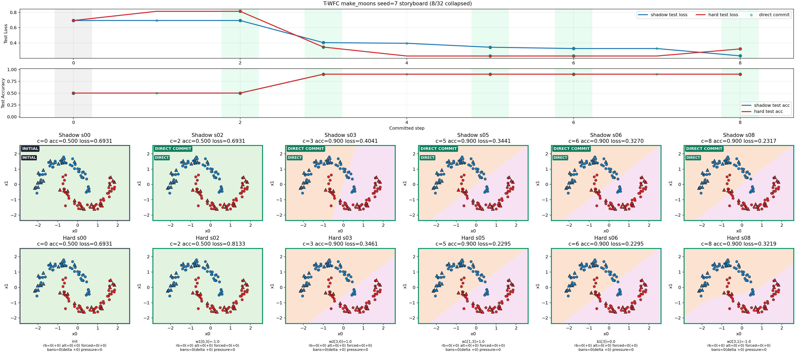
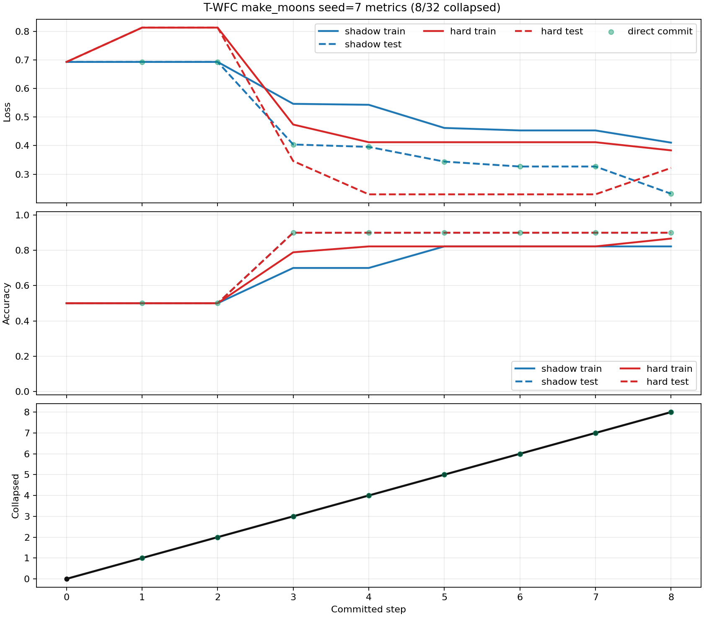
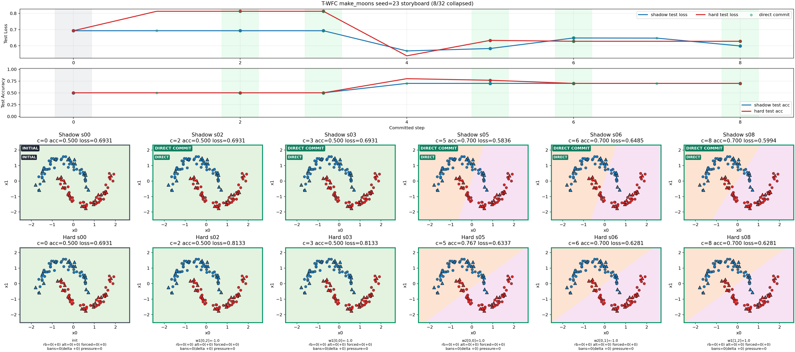
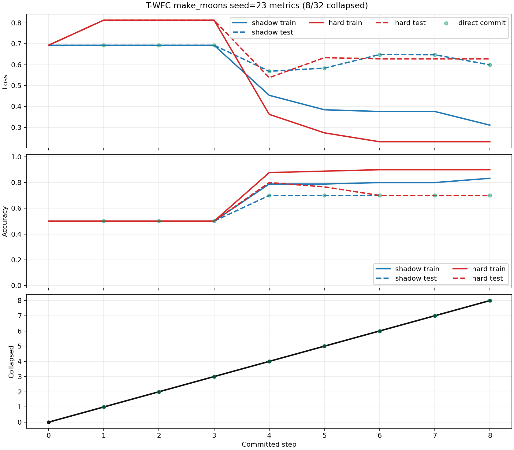

# T-WFC make_moons Seed Sweep

- Generated: 2026-03-16T20:26:53
- Dataset: `make_moons`
- Model: `2-6-2` with `32` parameters
- Seeds: `7, 11, 17, 23, 31`

## Configuration

- `samples`: `120`
- `noise`: `0.08`
- `hidden_layers`: `6`
- `initial_jitter`: `0.0`
- `observation_budget`: `8`
- `propagation_budget`: `6`
- `max_steps`: `8`
- `backtrack_tolerance`: `0.03`
- `rollback_depth`: `2`
- `rollback_depth_growth`: `0`
- `rollback_ban_count`: `1`
- `max_frontier_rollbacks`: `3`
- `max_attempt_multiplier`: `8`

## Aggregate Summary

- Mean shadow test accuracy: `0.787`
- Mean hard test accuracy: `0.780`
- Std hard test accuracy: `0.065`
- Mean shadow-hard test accuracy gap: `+0.007`
- Mean shadow test loss: `0.4533`
- Mean hard test loss: `0.4876`
- Mean hard-shadow test loss gap: `+0.0343`
- Mean rollback count: `0.00`
- Mean forced-commit count: `0.00`
- Max active forbidden values: `0`
- Max frontier pressure: `0`
- Best seed: `7` (hard test acc `0.900`)
- Worst seed: `23` (hard test acc `0.700`)

## Shadow vs Hard Divergence

- Seeds where hard test accuracy matched or exceeded shadow: `4/5`
- Largest shadow accuracy lead: `seed 31: shadow 0.800 vs hard 0.767 (gap +0.033)`
- Largest hard accuracy lead: `none` (hard never exceeded shadow on test accuracy in this batch)
- Largest hard loss penalty: `seed 7: shadow 0.2317 vs hard 0.3219 (gap +0.0902)`
- Largest hard loss gain: `seed 17: shadow 0.4745 vs hard 0.4730 (gap -0.0015)`
- Most aligned seed: `acc gap +0.000 (shadow 0.900, hard 0.900); loss gap +0.0902 (shadow 0.2317, hard 0.3219)`

## Highlights

### Best Seed: `7`

- Hard test accuracy/loss: `0.900` / `0.3219`
- Shadow vs hard: `acc gap +0.000 (shadow 0.900, hard 0.900); loss gap +0.0902 (shadow 0.2317, hard 0.3219)`
- Search pressure: `rb=0` `alt=0` `forced=0` `max_bans=0` `max_pressure=0`
- Peak ban focus: `clean`
- Latest ban delta: `none`
- Drilldown: [metrics](make_moons_seed_runs/seed_007/make_moons_seed_007_metrics.png) | [storyboard](make_moons_seed_runs/seed_007/make_moons_seed_007_storyboard.png) | [gif](make_moons_seed_runs/seed_007/make_moons_seed_007_steps.gif)

### Worst Seed: `23`

- Hard test accuracy/loss: `0.700` / `0.6281`
- Shadow vs hard: `acc gap +0.000 (shadow 0.700, hard 0.700); loss gap +0.0288 (shadow 0.5994, hard 0.6281)`
- Search pressure: `rb=0` `alt=0` `forced=0` `max_bans=0` `max_pressure=0`
- Peak ban focus: `clean`
- Latest ban delta: `none`
- Drilldown: [metrics](make_moons_seed_runs/seed_023/make_moons_seed_023_metrics.png) | [storyboard](make_moons_seed_runs/seed_023/make_moons_seed_023_storyboard.png) | [gif](make_moons_seed_runs/seed_023/make_moons_seed_023_steps.gif)

## Gallery

- Plot: [make_moons_seed_gallery.png](make_moons_seed_gallery.png)

## Seed Table

| Seed | Tag | Collapsed | Shadow Test Acc | Hard Test Acc | Acc Gap (S-H) | Hard Test Loss | Loss Gap (H-S) | Rollbacks | Alt Choices | Forced | Max Bans | Max Pressure | Peak Ban Focus | Latest Ban Delta | Metrics | Storyboard | GIF |
|------|-----|-----------|-----------------|---------------|---------------|----------------|----------------|-----------|-------------|--------|----------|--------------|----------------|------------------|---------|------------|-----|
| 7 | BEST | 8/32 | 0.900 | 0.900 | +0.000 | 0.3219 | +0.0902 | 0 | 0 | 0 | 0 | 0 | clean | none | [metrics](make_moons_seed_runs/seed_007/make_moons_seed_007_metrics.png) | [storyboard](make_moons_seed_runs/seed_007/make_moons_seed_007_storyboard.png) | [gif](make_moons_seed_runs/seed_007/make_moons_seed_007_steps.gif) |
| 11 | - | 8/32 | 0.767 | 0.767 | +0.000 | 0.5484 | +0.0480 | 0 | 0 | 0 | 0 | 0 | clean | none | [metrics](make_moons_seed_runs/seed_011/make_moons_seed_011_metrics.png) | [storyboard](make_moons_seed_runs/seed_011/make_moons_seed_011_storyboard.png) | [gif](make_moons_seed_runs/seed_011/make_moons_seed_011_steps.gif) |
| 17 | - | 8/32 | 0.767 | 0.767 | +0.000 | 0.4730 | -0.0015 | 0 | 0 | 0 | 0 | 0 | clean | none | [metrics](make_moons_seed_runs/seed_017/make_moons_seed_017_metrics.png) | [storyboard](make_moons_seed_runs/seed_017/make_moons_seed_017_storyboard.png) | [gif](make_moons_seed_runs/seed_017/make_moons_seed_017_steps.gif) |
| 23 | WORST | 8/32 | 0.700 | 0.700 | +0.000 | 0.6281 | +0.0288 | 0 | 0 | 0 | 0 | 0 | clean | none | [metrics](make_moons_seed_runs/seed_023/make_moons_seed_023_metrics.png) | [storyboard](make_moons_seed_runs/seed_023/make_moons_seed_023_storyboard.png) | [gif](make_moons_seed_runs/seed_023/make_moons_seed_023_steps.gif) |
| 31 | - | 8/32 | 0.800 | 0.767 | +0.033 | 0.4664 | +0.0061 | 0 | 0 | 0 | 0 | 0 | clean | none | [metrics](make_moons_seed_runs/seed_031/make_moons_seed_031_metrics.png) | [storyboard](make_moons_seed_runs/seed_031/make_moons_seed_031_storyboard.png) | [gif](make_moons_seed_runs/seed_031/make_moons_seed_031_steps.gif) |

## Notes

- `Acc Gap (S-H)` is `shadow test accuracy - hard test accuracy`, so positive values mean shadow stayed ahead.
- `Loss Gap (H-S)` is `hard test loss - shadow test loss`, so positive values mean hard stayed worse.
- `Max Bans` counts the largest number of active forbidden candidate values seen during the run.
- `Max Pressure` counts the highest rollback pressure observed at a single search frontier before a commit.
- `Storyboard` and `GIF` links appear only for 2D datasets where decision-surface rendering is available.

## Seed Drilldown

### Seed 7 [BEST]

- Shadow vs hard: `acc gap +0.000 (shadow 0.900, hard 0.900); loss gap +0.0902 (shadow 0.2317, hard 0.3219)`
- Peak Ban Focus: `clean`
- Latest Ban Delta: `none`
- Metrics: [open](make_moons_seed_runs/seed_007/make_moons_seed_007_metrics.png)
- Storyboard: [open](make_moons_seed_runs/seed_007/make_moons_seed_007_storyboard.png)
- GIF: [open](make_moons_seed_runs/seed_007/make_moons_seed_007_steps.gif)

### Seed 23 [WORST]

- Shadow vs hard: `acc gap +0.000 (shadow 0.700, hard 0.700); loss gap +0.0288 (shadow 0.5994, hard 0.6281)`
- Peak Ban Focus: `clean`
- Latest Ban Delta: `none`
- Metrics: [open](make_moons_seed_runs/seed_023/make_moons_seed_023_metrics.png)
- Storyboard: [open](make_moons_seed_runs/seed_023/make_moons_seed_023_storyboard.png)
- GIF: [open](make_moons_seed_runs/seed_023/make_moons_seed_023_steps.gif)

### Seed 11

- Shadow vs hard: `acc gap +0.000 (shadow 0.767, hard 0.767); loss gap +0.0480 (shadow 0.5004, hard 0.5484)`
- Peak Ban Focus: `clean`
- Latest Ban Delta: `none`
- Metrics: [open](make_moons_seed_runs/seed_011/make_moons_seed_011_metrics.png)
- Storyboard: [open](make_moons_seed_runs/seed_011/make_moons_seed_011_storyboard.png)
- GIF: [open](make_moons_seed_runs/seed_011/make_moons_seed_011_steps.gif)

### Seed 17

- Shadow vs hard: `acc gap +0.000 (shadow 0.767, hard 0.767); loss gap -0.0015 (shadow 0.4745, hard 0.4730)`
- Peak Ban Focus: `clean`
- Latest Ban Delta: `none`
- Metrics: [open](make_moons_seed_runs/seed_017/make_moons_seed_017_metrics.png)
- Storyboard: [open](make_moons_seed_runs/seed_017/make_moons_seed_017_storyboard.png)
- GIF: [open](make_moons_seed_runs/seed_017/make_moons_seed_017_steps.gif)

### Seed 31

- Shadow vs hard: `acc gap +0.033 (shadow 0.800, hard 0.767); loss gap +0.0061 (shadow 0.4604, hard 0.4664)`
- Peak Ban Focus: `clean`
- Latest Ban Delta: `none`
- Metrics: [open](make_moons_seed_runs/seed_031/make_moons_seed_031_metrics.png)
- Storyboard: [open](make_moons_seed_runs/seed_031/make_moons_seed_031_storyboard.png)
- GIF: [open](make_moons_seed_runs/seed_031/make_moons_seed_031_steps.gif)

